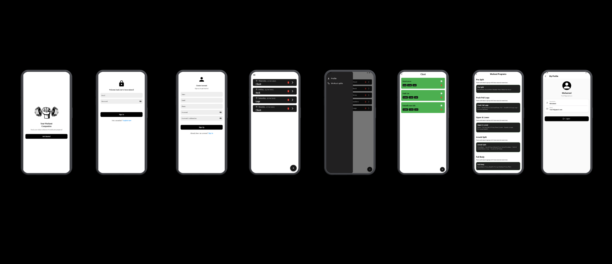
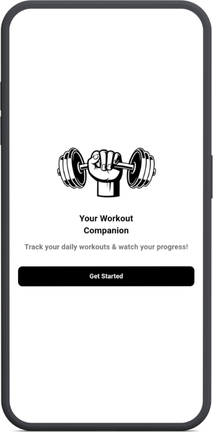
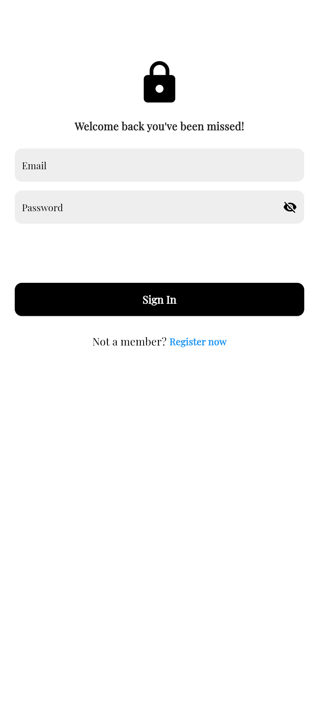
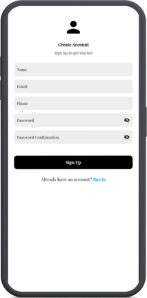
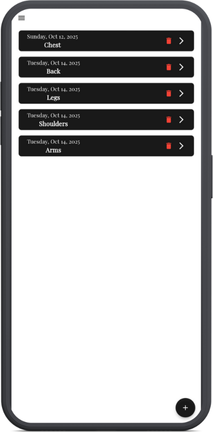
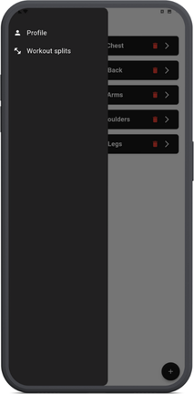
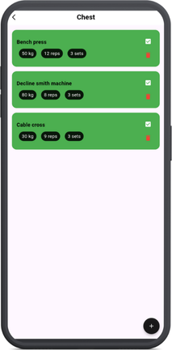
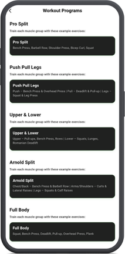
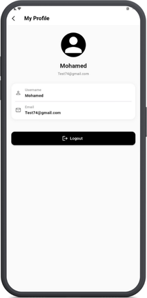

# Athlio – Fitness Tracking App 🦾                                                                                                                  
                                                                                                                                                   
## 🌟Overview                                                                                                                                       
- Athlio is a Flutter app that helps users track workouts, browse exercises and explore different workout splits.                                  
                                                                                                                                                   
 <p align="center">                                                                                                                                
                                                               
</p>                                                                                                                                               
                                                                                                                                                   
                                                                                                                                                   
## ✨Views                                                                                                                                          
🖼️ **Onboarding View:**                                                                                                                             
  - Welcomes users to Athlio, the ultimate workout companion app                                                                                   
  - Includes the app logo                                                                                                                          
  - Motivational tagline — “Track your daily exercise & watch your progress!”                                                                      
  - “Get Started” button navigates to the Login view                                                                                               
                                                                                                                                                   
  <p align="left">                                                                                                                                 
                                                                   
</p>                                                                                                                                               
                                                                                                                                                   
##                                                                                                                                                 
                                                                                                                                                   
🔐 **Login View:**                                                                                                                                  
  - 📧 Allows registered users to sign in using Email and Password                                                                                  
  - 🆕 “Register now” navigation button for new users                                                                                               
  - ✅ On successful login, users are directed to the Workout View                                                                                  
                                                                                                                                                   
  <p align="left">  </p>                                                
                                                                                                                                                   
  ##                                                                                                                                               
                                                                                                                                                   
📝 **Sign-Up View:**                                                                                                                                
  - 📝 Enables new users to create an account by entering: Name, Email, Phone, Password, and Confirm Password                                       
  - ✅ On successful sign-up, users are directed to the Workout View                                                                                
  - ↩️ "Already have an account?" option                                                                                                            
  - ➡️ "Sign In" navigation button                                                                                                                  
                                                                                                                                                   
  <p align="left">                                                                                                                                 
                                                                       
</p>                                                                                                                                               
                                                                                                                                                   
##                                                                                                                                                 
                                                                                                                                                   
🏠 **Workout View:**                                                                                                                                
  - 💪 Displays the list of workouts (e.g., Chest, Back, Arms, Shoulders, Legs)                                                                     
  - 🗓️ Each workout card shows the date and muscle group                                                                                            
  - ➕ Users can add a new workout via the Floating Action Button (FAB)                                                                             
                                                                                                                                                   
  <p align="left">                                                                                                                                 
                                                                          
</p>                                                                                                                                               
                                                                                                                                                   
##                                                                                                                                                 
                                                                                                                                                   
📂 **Navigation Drawer:**                                                                                                                           
  - 🧭 Provides quick access to main app sections: Profile and Workout Splits                                                                       
  - 📲 Opens from the side menu icon for seamless navigation                                                                                        
                                                                                                                                                   
  <p align="left">                                                                                                                                 
                                                                         
</p>                                                                                                                                               
                                                                                                                                                   
##                                                                                                                                                 
                                                                                                                                                   
🏋️‍♀️ **Exercises View:**                                                                                                                             
  - 📋 Displays all exercises related to the selected workout (e.g., Bench Press, Cable Cross)                                                      
  - 🏷️ Each card includes exercise name, sets, reps, and weights                                                                                    
  - ✅ Completed exercises are highlighted in green                                                                                                 
  - ➕ Users can easily add or delete exercises                                                                                                     
                                                                                                                                                   
  <p align="left">                                                                                                                                 
                                                                     
</p>                                                                                                                                               
                                                                                                                                                   
##                                                                                                                                                 
                                                                                                                                                   
🧩 **Workout Splits View:**                                                                                                                         
  - 🧠 Displays available training programs such as: Pro Split, Push Pull Legs, Upper & Lower, Arnold Split, Full Body                              
  - 📖 Each split includes a short description of its focus and structure                                                                           
                                                                                                                                                   
<p align="left">                                                                                                                                   
                                                                
</p>                                                                                                                                               
                                                                                                                                                   
##                                                                                                                                                 
                                                                                                                                                   
👤 **Profile View:**                                                                                                                                
  - 🪪 Displays user info, including Name and Email                                                                                                 
  - 🚪 Includes a Logout button for secure sign-out                                                                                                 
                                                                                                                                                   
<p align="left">                                                                                                                                   
                                                                       
</p>                                                                                                                                               
                                                                                                                                                   
                                                                                                                                                   
## 🛠️ Tech Stack                                                                                                                                    
                                                                                                                                                   
📱 Frontend                                                                                                                                         
- Framework: Flutter                                                                                                                               
- State Management: Bloc                                                                                                                           
                                                                                                                                                   
🌐 Backend                                                                                                                                          
- API: [Rest API]                                                                                                                                  
                                                                                                                                                   
                                                                                                                                                   
                                                                                                                                                   
## 🏗️ Architecture                                                                                                                                  
  - 🧩 MVVM pattern                                                                                                                                 
  - 📡 REST API integration                                                                                                                         
  - 💽 Local storage                                                                                                                                
                                                                                                                                                   
```                                                                                                                                                
lib/                                                                                                                                               
│                                                                                                                                                  
├── core/                      # 🧩 Shared logic and reusable components                                                                            
│   ├── di/                    # Dependency injection (service locator, initialization)                                                            
│   ├── functions/             # Global helper functions                                                                                           
│   ├── networking/            # API services, models, and network configuration                                                                   
│   ├── routing/               # AppRouter and navigation logic                                                                                    
│   ├── utils/                 # Constants, colors, styles, and utility classes                                                                    
│   └── widgets/               # Common UI widgets (buttons, loaders, etc.)                                                                        
│                                                                                                                                                  
└── features/                  # 🧠 Feature-based structure (each module is independent)                                                            
    ├── home/                  # Displays list of workouts (e.g., Back, Chest, Legs)                                                               
    ├── exercises/             # Displays exercises for a selected workout                                                                         
    ├── login/                 # Handles user authentication (login flow)                                                                          
    ├── signup/                # Handles user registration (sign-up flow)                                                                          
    ├── onboarding/            # First-time app introduction screens                                                                               
    ├── profile/               # User profile and account management                                                                               
    └── workout_splits/        # User-defined workout programs or training splits                                                                  
                                                                                                                                                   
assets/                                                                                                                                            
├── fonts/           # Custom app fonts                                                                                                            
├── images/          # App icons, logos, and illustrations                                                                                         
└── screenShots/     # App preview screenshots for the README                                                                                      
                                                                                                                                                   
```                                                                                                                                                
                                                                                                                                                   
**Key Points:**                                                                                                                                    
                                                                                                                                                   
- **core/**: Common utilities, local storage services, and shared widgets used across the app.                                                     
- **features/**: Each feature (Onboarding, Home, Workout splits, Exercises, Profile) is isolated with its own data and presentation layers.        
- **data/**: Contains models and repository implementations for each feature.                                                                      
- **presentation/manager/**: State management (Cubit/BLoC) for each feature.                                                                       
- **presentation/views/**: Screens/pages for each feature.                                                                                         
- **presentation/widgets/**: UI components and reusable widgets specific to each feature.                                                          
- **assets/**: Static resources such as images and icons.                                                                                          
- **main.dart**: App entry point.                                                                                                                  
---                                                                                                                                                
                                                                                                                                                   
**This structure is scalable, modular, and easy to maintain as your app grows.**